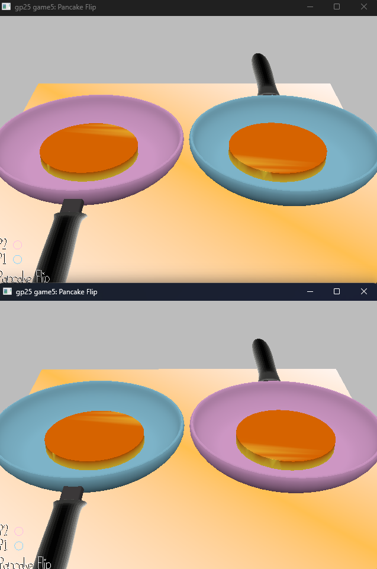

# Pancake Flip

Author: Shangyi Zhu

Design: This is a 2-player competitive game in a fixed camera 3D scene where the person that flips the most number of perfect pancakes wins. 

Networking: (TODO: How does your game implement client/server multiplayer? What messages are transmitted? Where in the code?)

Screen Shot:

How To Play:

Each person will have to flip the pancakes in a pan in front of them within 1 second of hearing "ding!" to get the perfect browned side of their pancake. 
Each round has 5 pancakes, and whoever gets the most number of perfect pancakes wins.

This game was built with [NEST](NEST.md).

